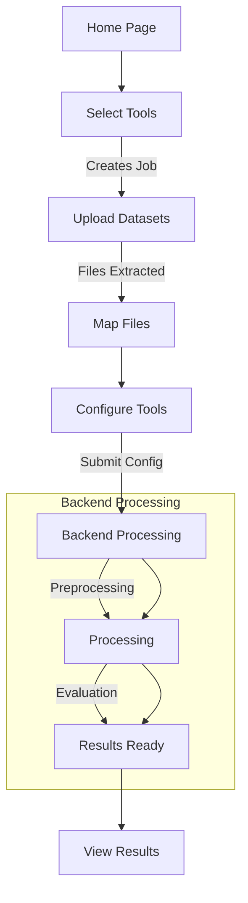

# Trances-PRS Benchmarking System Documentation

A comprehensive Next.js-based frontend application for configuring, running, and comparing Polygenic Risk Score (PRS) tools across populations.

---

## Table of Contents

1. [Overview](#overview)
2. [Architecture Summary](#architecture-summary)
3. [Project Structure](#project-structure)
4. [Getting Started](#getting-started)
5. [Environment Configuration](#environment-configuration)
6. [Core Concepts](#core-concepts)
7. [Workflow: Job Lifecycle](#workflow-job-lifecycle)
8. [State Management](#state-management)
9. [Tool Registry System](#tool-registry-system)
10. [API Integration](#api-integration)
11. [Adding New Tools](#adding-new-tools)
12. [Component Reference](#component-reference)
13. [Key Files Reference](#key-files-reference)

---

## Overview

The **Trances-PRS Benchmarking Framework** is a visual workflow system that enables researchers to:

- **Configure** multiple PRS tools (PRSice, PRScsx, BridgePRS, SDPRX, XPASS, XPASS+)
- **Upload** datasets (genotype, phenotype, summary statistics files)
- **Map** files to tool-specific configuration fields
- **Process** data through a backend pipeline
- **Compare** results with visual summaries, plots, and metrics (R², AUC)

The frontend communicates with a Python-based backend API that handles file processing, job orchestration, and tool execution.

---

## Architecture Summary

```
┌─────────────────────────────────────────────────────────────────────────┐
│                          Frontend (Next.js)                              │
├─────────────────────────────────────────────────────────────────────────┤
│  ┌─────────────┐  ┌─────────────┐  ┌─────────────┐  ┌─────────────┐    │
│  │   Page      │  │   Store     │  │  Components │  │   Hooks     │    │
│  │ (Workflow)  │◄─┤  (Zustand)  │◄─┤ (UI + Logic)│◄─┤(Data Fetch) │    │
│  └─────────────┘  └─────────────┘  └─────────────┘  └─────────────┘    │
│         │                 │                │                │           │
│         ▼                 ▼                ▼                ▼           │
│  ┌──────────────────────────────────────────────────────────────────┐  │
│  │                    Tool Registry (Plugin System)                  │  │
│  │   - Tool definitions, configs, payload builders, sanitizers      │  │
│  └──────────────────────────────────────────────────────────────────┘  │
└─────────────────────────────────────────────────────────────────────────┘
                                    │
                                    │ HTTP/REST + SSE
                                    ▼
┌─────────────────────────────────────────────────────────────────────────┐
│                         Backend API (FastAPI)                            │
├─────────────────────────────────────────────────────────────────────────┤
│  /api/v1/benchmarks                                                      │
│  ├── POST /jobs              → Create benchmark job                      │
│  ├── GET  /{job_id}          → Get job status                            │
│  ├── POST /upload            → Upload dataset files                      │
│  ├── GET  /{job_id}/explore  → Explore uploaded dataset structure        │
│  ├── GET  /{job_id}/preview  → Preview file contents                     │
│  ├── POST /{job_id}/config   → Submit preprocessing + processing config  │
│  ├── GET  /{job_id}/results  → Get results manifest                      │
│  └── SSE  /{job_id}/stream   → Real-time job status updates              │
└─────────────────────────────────────────────────────────────────────────┘
```

**Key Design Patterns:**

| Pattern                      | Usage                                                     |
| ---------------------------- | --------------------------------------------------------- |
| **Tool Registry**            | Central plugin-based system for adding/removing PRS tools |
| **Zustand Store**            | Global state management with persistence                  |
| **Payload Builders**         | Tool-specific logic for constructing API payloads         |
| **Population Configuration** | Multi-population support per tool (target/source/base)    |

---

## Project Structure

```
psychegen-africa/
├── docs/                              # Documentation
│   ├── SYSTEM_DOCUMENTATION.md        # This file
│   └── adding-new-tools.md            # Guide for adding new PRS tools
│
├── public/                            # Static assets
│
├── src/
│   ├── app/                           # Next.js App Router
│   │   ├── (landing-routes)/
│   │   │   └── benchmarking/
│   │   │       └── page.tsx           # Main benchmarking workflow page
│   │   └── api/                       # API routes (if any)
│   │
│   ├── components/
│   │   ├── benchmarking/              # Benchmarking feature components
│   │   │   ├── benchmarking-home.tsx          # Landing/intro page
│   │   │   ├── tool-selection.tsx             # Step 1: Tool selection
│   │   │   ├── dataset-upload.tsx             # Step 2: File upload
│   │   │   ├── mapping.tsx                    # Step 3: File mapping
│   │   │   ├── tool-configuration.tsx         # Step 4: Tool config
│   │   │   ├── benchmarking-results.tsx       # Step 5: Results view
│   │   │   ├── job-tracker.tsx                # SSE-based job monitoring
│   │   │   ├── job-status.tsx                 # Job status display
│   │   │   ├── file-explorer/                 # Dataset exploration UI
│   │   │   ├── mapping/                       # Mapping sub-components
│   │   │   │   └── tools/                     # Tool-specific population configs
│   │   │   ├── tool-configuration/            # Tool-specific config components
│   │   │   │   ├── types.ts                   # Type definitions (all tools)
│   │   │   │   ├── column-aliases.ts          # Column name aliases
│   │   │   │   ├── PrsiceToolConfiguration.tsx
│   │   │   │   ├── PrscsxToolConfiguration.tsx
│   │   │   │   ├── BridgeprsToolConfiguration.tsx
│   │   │   │   ├── SdprxToolConfiguration.tsx
│   │   │   │   ├── XpassToolConfiguration.tsx
│   │   │   │   └── XpassPlusToolConfiguration.tsx
│   │   │   └── payload-builders/              # API payload construction
│   │   │       ├── index.ts
│   │   │       ├── prscsx-builder.ts
│   │   │       ├── bridgeprs-builder.ts
│   │   │       ├── sdprx-builder.ts
│   │   │       ├── prsice-builder.ts
│   │   │       ├── xpass-builder.ts
│   │   │       └── sanitizers.ts
│   │   │
│   │   └── ui/                        # Reusable UI components (shadcn/ui)
│   │
│   ├── hooks/                         # Custom React hooks
│   │   ├── useMappingJobStatus.ts     # Job status polling hook
│   │   ├── usePrsiceConfiguration.ts  # Tool-specific config hooks
│   │   ├── usePrscsxConfiguration.ts
│   │   └── ...
│   │
│   ├── lib/                           # Utilities and configuration
│   │   ├── config.ts                  # API endpoints, reference paths
│   │   ├── tool-registry.ts           # Tool plugin registry
│   │   └── utils.ts                   # Helper functions
│   │
│   ├── services/                      # API client layer
│   │   ├── axios-client.ts            # Axios instance
│   │   └── endpoint.ts                # Generic API call wrapper
│   │
│   ├── stores/                        # Zustand state management
│   │   └── benchmarking-store.ts      # Main workflow state
│   │
│   └── types/                         # TypeScript type definitions
│
├── reference/                         # Example configs for testing
│   └── test-config.json
│
├── .env.local                         # Environment variables
├── package.json
├── tailwind.config.ts
└── README.md
```

---

## Getting Started

### Prerequisites

- **Node.js** 18+
- **npm** or **yarn** or **pnpm**
- **Backend API** running (see environment config)

### Installation

```bash
# Clone the repository
git clone https://github.com/dadaibidaponysc1234/psy.git
cd psy

# Switch to development branch
git checkout prs-dev
git pull

# Install dependencies
npm install

# Start the development server
npm run dev
```

The app will be available at [http://localhost:7500](http://localhost:7500).

### Build for Production

```bash
npm run build
npm run start
```

---

## Environment Configuration

Create a `.env.local` file in the project root:

```bash
# Benchmark Backend API Base URL
NEXT_PUBLIC_BENCHMARK_BASE_URL=http://localhost:8000/api/v1/benchmarks
```

For production, update this to point to your production backend.

### Reference Paths (Advanced)

Tool-specific reference data paths are configured in `src/lib/config.ts`:

```typescript
export const REFERENCE_PATHS = {
  SDPRX_LD_REF: "/path/to/ldref/data",
  BRIDGEPRS_LD_REF: "/path/to/bridgeprs/1000G_5P",
  PRSCSX_LD_REF: "ld_ref",
}
```

These are used by payload builders to construct processing configurations.

---

## Core Concepts

### 1. Workflow Steps

The benchmarking workflow consists of 5 sequential steps:

| Step | ID            | Component             | Description                                              |
| ---- | ------------- | --------------------- | -------------------------------------------------------- |
| 1    | `tools`       | `ToolSelection`       | Select PRS tools to benchmark                            |
| 2    | `datasets`    | `DatasetUpload`       | Upload genotype, phenotype, and summary statistics files |
| 3    | `populations` | `Mapping`             | Map uploaded files to tool-specific configuration fields |
| 4    | `configure`   | `ToolConfiguration`   | Configure preprocessing and processing parameters        |
| 5    | `results`     | `BenchmarkingResults` | View results, plots, and download artifacts              |

### 2. Tools Supported

| Tool ID     | Label     | Description                                   |
| ----------- | --------- | --------------------------------------------- |
| `prsice`    | PRSice    | Standard PRS calculation and evaluation       |
| `prscsx`    | PRScsx    | Cross-population polygenic prediction         |
| `bridgeprs` | BridgePRS | Transfer learning across populations          |
| `sdprx`     | SDPRX     | Supervised dimensionality reduction PRS       |
| `xpass`     | XPASS     | Cross-population PRS with genetic correlation |
| `xpass+`    | XPASS+    | Enhanced XPASS variant                        |

### 3. Evaluation Types

Jobs can be configured for:

- **Binary phenotypes** — Disease traits (case/control)
- **Quantitative phenotypes** — Continuous traits
- **Both** — Run both evaluation types

---

## Workflow: Job Lifecycle



### Step-by-Step Flow

#### 1. Tool Selection (`tool-selection.tsx`)

- User selects one or more tools
- On "Next", a **job is created** via `POST /jobs`
- Job ID is stored in Zustand store

#### 2. Dataset Upload (`dataset-upload.tsx`)

- User uploads files (genotype, phenotype, sumstats)
- Files are uploaded via `POST /upload?job_id={job_id}`
- Backend extracts ZIP/TAR archives
- Progress tracked via upload progress bar

#### 3. File Mapping (`mapping.tsx`)

- Backend explores uploaded files via `GET /{job_id}/explore`
- User assigns files/directories to tool-specific fields:
  - Summary statistics path
  - Genotype directory
  - Phenotype file
- File previews available via `GET /{job_id}/preview/{path}`

#### 4. Tool Configuration (`tool-configuration.tsx`)

- Per-tool tabs for detailed configuration:
  - Column mappings (auto-detected from file headers)
  - Phenotype trait selection
  - Genotype file patterns
  - Processing options
- On submit: `POST /{job_id}/config` with full payload

#### 5. Results (`benchmarking-results.tsx`)

- Poll `GET /{job_id}/results` for manifest
- Display:
  - **Plots** (bar charts, scatter plots)
  - **Tables** (R², AUC metrics)
  - **Artifacts** (logs, intermediate files)
- Download all as archive

### Job Status Polling

The `useMappingJobStatus` hook polls job status:

```typescript
const { status, isTerminal, checkStatus } = useMappingJobStatus({
  jobId,
  pollInterval: 5000, // 5 seconds
})
```

**Terminal statuses:** `completed`, `failed`, `cancelled`

Real-time updates also available via **Server-Sent Events (SSE)** in `job-tracker.tsx`.

---

## State Management

The app uses **Zustand** for global state with persistence:

### Store: `benchmarking-store.ts`

```typescript
interface BenchmarkingState {
  // Job State
  jobId: string | null
  jobStatus: string | null

  // Workflow State
  activeStep: string
  completedSteps: string[]
  stepData: Record<string, any>

  // Upload State
  uploadedFiles: Array<{ id; name; size; type; file? }>
  isUploading: boolean
  uploadProgress: number

  // Mapping State (per-tool)
  mappingState: Record<string, MappingJobState>

  // UI State
  isSidebarCollapsed: boolean

  // Actions
  setJobId(id: string | null): void
  setActiveStep(step: string): void
  addCompletedStep(step: string): void
  setStepData(stepId: string, data: any): void
  setToolMappings(toolId: string, mappings: Record<string, unknown>): void
  resetWorkflow(): void
  // ... more actions
}
```

### Persistence

State is persisted to `localStorage` via Zustand's `persist` middleware:

```typescript
persist(
  (set, get) => ({ ... }),
  {
    name: "benchmarking-storage",
    storage: createJSONStorage(() => localStorage),
  }
)
```

---

## Tool Registry System

The **Tool Registry** (`src/lib/tool-registry.ts`) is a plugin-based architecture for managing PRS tools.

### Tool Definition

```typescript
interface ToolDefinition<TConfig, TProcessingState, TProcessingPayload> {
  id: string                           // e.g., "prscsx"
  label: string                        // e.g., "PRScsx"
  description: string

  requiredColumns: string[]            // e.g., ["SNP", "A1", "BETA", "P"]
  optionalColumns?: string[]

  supportsBinaryPhenotypes: boolean
  supportsQuantitativePhenotypes: boolean

  populationCount: number              // e.g., 2 for target+source
  populationLabels: string[]           // e.g., ["Target", "Source"]

  ConfigurationComponent: ComponentType<...>
  PopulationConfigurationComponent: ComponentType<...>

  sanitizeConfig: (config: TConfig) => TConfig
  buildProcessingPayload: (config, state, mode) => TProcessingPayload

  getDefaultConfig: () => TConfig
  getDefaultProcessingState?: () => TProcessingState
}
```

### Helper Functions

```typescript
import {
  getToolIds,
  getToolDefinition,
  getToolLabel,
  isToolRegistered,
  getToolsForEvaluationType,
} from "@/lib/tool-registry"

// Get all registered tools
const toolIds = getToolIds() // ["prsice", "prscsx", "bridgeprs", ...]

// Get tool definition
const tool = getToolDefinition("prscsx")

// Get tools supporting binary phenotypes
const binaryTools = getToolsForEvaluationType("binary")
```

---

## API Integration

### Endpoints (via `src/lib/config.ts`)

| Helper Function                       | Endpoint                       | Description    |
| ------------------------------------- | ------------------------------ | -------------- |
| `getBenchmarkJobsUrl()`               | `POST /jobs`                   | Create new job |
| `getBenchmarkJobStatusUrl(jobId)`     | `GET /{job_id}`                | Get job status |
| `getBenchmarkUploadUrl(jobId)`        | `POST /upload?job_id=...`      | Upload files   |
| `getBenchmarkPreviewUrl(jobId, path)` | `GET /{job_id}/preview/{path}` | Preview file   |
| `getBenchmarkConfigUrl(jobId)`        | `POST /{job_id}/config`        | Submit config  |

### Example: Creating a Job

```typescript
import axios from "axios"
import { getBenchmarkJobsUrl } from "@/lib/config"

const response = await axios.post(getBenchmarkJobsUrl(), {
  tools: ["prscsx", "prsice"],
})

const { job_id, status } = response.data
```

### Example: Submitting Configuration

```typescript
import axios from "axios"
import { getBenchmarkConfigUrl } from "@/lib/config"

await axios.post(getBenchmarkConfigUrl(jobId), {
  pre_processing: { ... },  // Tool configs
  processing: { ... },       // Runtime params
  tools_to_run: ["prscsx"],
})
```

---

## Adding New Tools

See the detailed guide: [docs/adding-new-tools.md](./adding-new-tools.md)

### Quick Summary

1. **Add types** in `tool-configuration/types.ts`
2. **Create configuration component** in `tool-configuration/NewToolConfiguration.tsx`
3. **Create population component** in `mapping/tools/newtool-population-configuration.tsx`
4. **Create payload builder** in `payload-builders/newtool-builder.ts`
5. **Register in** `lib/tool-registry.ts`

---

## Component Reference

### Main Workflow Components

| Component             | File                                         | Responsibility                |
| --------------------- | -------------------------------------------- | ----------------------------- |
| `BenchmarkingPage`    | `app/(landing-routes)/benchmarking/page.tsx` | Main page, step orchestration |
| `Sidebar`             | (same file)                                  | Navigation, step indicators   |
| `BenchmarkingHome`    | `benchmarking-home.tsx`                      | Landing page                  |
| `ToolSelection`       | `tool-selection.tsx`                         | Tool picker + job creation    |
| `DatasetUpload`       | `dataset-upload.tsx`                         | File upload with progress     |
| `Mapping`             | `mapping.tsx`                                | Drag-drop file assignment     |
| `ToolConfiguration`   | `tool-configuration.tsx`                     | Per-tool config forms         |
| `BenchmarkingResults` | `benchmarking-results.tsx`                   | Results display               |
| `JobTracker`          | `job-tracker.tsx`                            | SSE-based status monitoring   |

### Tool-Specific Components

| Component                    | Tool      |
| ---------------------------- | --------- |
| `PrsiceToolConfiguration`    | PRSice    |
| `PrscsxToolConfiguration`    | PRScsx    |
| `BridgeprsToolConfiguration` | BridgePRS |
| `SdprxToolConfiguration`     | SDPRX     |
| `XpassToolConfiguration`     | XPASS     |
| `XpassPlusToolConfiguration` | XPASS+    |

---

## Key Files Reference

| File                                                      | Purpose                   |
| --------------------------------------------------------- | ------------------------- |
| `src/lib/config.ts`                                       | API URLs, reference paths |
| `src/lib/tool-registry.ts`                                | Tool plugin system        |
| `src/stores/benchmarking-store.ts`                        | Global Zustand state      |
| `src/components/benchmarking/tool-configuration/types.ts` | All tool type definitions |
| `src/components/benchmarking/payload-builders.ts`         | Payload builder exports   |
| `src/hooks/useMappingJobStatus.ts`                        | Job polling hook          |

---

## Development Tips

### TypeScript Check

```bash
npx tsc --noEmit
```

### Running Tests

```bash
npm test
```

### Linting

```bash
npm run lint
```

### Debugging API Calls

- Open browser DevTools → Network tab
- Filter by `XHR` or `Fetch`
- Check payloads sent to `/{job_id}/config`

---

## Troubleshooting

### "Job creation failed"

- Ensure backend is running at the configured URL
- Check `.env.local` has correct `NEXT_PUBLIC_BENCHMARK_BASE_URL`

### Files not appearing in mapping

- Wait for ZIP extraction to complete
- Check job status — should be `uploaded` or `processing`
- Refresh the explore data

### Configuration validation errors

- Check required column mappings are set
- Ensure phenotype traits are selected
- Verify file paths are correctly mapped
